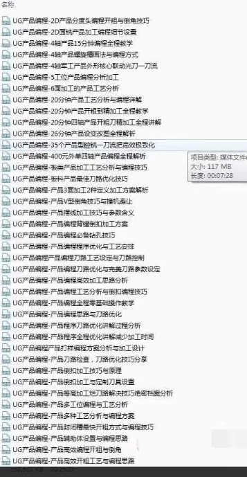

# UG Product Programming Techniques 104 Cases in Practice, Product Programming Techniques 104 Cases Programming Visual

## Body

UG Product Programming Techniques 104 Cases in Practice Course, Product Programming Techniques 104 Cases in Practice Course, Product Programming Techniques 104 Cases in Practice Course

UG Product Programming Techniques 104 Cases in Practice Course, Product Programming Techniques 104 Cases in Practice Course, Product Programming Techniques 104 Cases in Practice Course

UG Product Programming Techniques 104 Cases in Practice Course, Product Programming Techniques 104 Cases in Practice Course, Product Programming Techniques 104 Cases in Practice Course

UG Product Programming Techniques 104 Cases in Practice Course, Product Programming Techniques 104 Cases in Practice Course, Product Programming Techniques 104 Cases in Practice Course

UG Product Programming Techniques 104 Cases in Practice Course, Product Programming Techniques 104 Cases in Practice Course, Product Programming Techniques 104 Cases in Practice Course

UG Product Programming Techniques 104 Cases in Practice Course, Product Programming Techniques 104 Cases in Practice Course, Product Programming Techniques 104 Cases in Practice Course

UG Product Programming Techniques 104 Cases in Practice Course, Product Programming Techniques 104 Cases in Practice Course, Product Programming Techniques 104 Cases in Practice Course

UG Product Programming Techniques 104 Cases in Practice Course, Product Programming Techniques 104 Cases in Practice Course, Product Programming Techniques 104 Cases in Practice Course

UG Product Programming Techniques 104 Cases in Practice Course, Product Programming Techniques 104 Cases in Practice Course, Product Programming Techniques 104 Cases in Practice Course

UG Product Programming Techniques 104 Cases in Practice Course, Product Programming Techniques 104 Cases in Practice Course, Product Programming Techniques 104 Cases in Practice Course

UG Product Programming Techniques 104 Cases in Practice Course, Product Programming Techniques 104 Cases in Practice Course, Product Programming Techniques 104 Cases in Practice Course

UG Product Programming Techniques 104 Cases in Practice Course, Product Programming Techniques 104 Cases in Practice Course, Product Programming Techniques 104 Cases in Practice Course

UG Product Programming Techniques 104 Cases in Practice Course, Product Programming Techniques 104 Cases in Practice Course, Product Programming Techniques 104 Cases in Practice Course

UG Product Programming Techniques 104 Cases in Practice Course, Product Programming Techniques 104 Cases in Practice Course, Product Programming Techniques 104 Cases in Practice Course

UG Product Programming Techniques 104 Cases in Practice Course, Product Programming Techniques 104 Cases in Practice Course, Product Programming Techniques 104 Cases in Practice Course

UG Product Programming Techniques 104 Cases in Practice Course, Product Programming Techniques 104 Cases in Practice Course, Product Programming Techniques 104 Cases in Practice Course

UG Product Programming Techniques 104 Cases in Practice Course, Product Programming Techniques 104 Cases in Practice Course, Product Programming Techniques 104 Cases in Practice Course

UG Product Programming Techniques 104 Cases in Practice Course, Product Programming Techniques 104 Cases in Practice Course, Product Programming Techniques 104 Cases in Practice Course

UG Product Programming Techniques 104 Cases in Practice Course, Product Programming Techniques 104 Cases in Practice Course, Product Programming Techniques 104 Cases in Practice Course

UG Product Programming Techniques 104 Cases in Practice Course, Product Programming Techniques 104 Cases in Practice Course, Product Programming Techniques 104 Cases in Practice Course

UG Product Programming Techniques 104 Cases in Practice Course, Product Programming Techniques 104 Cases in Practice Course, Product Programming Techniques 104 Cases in Practice Course

UG Product Programming Techniques 104 Cases in Practice Course, Product Programming Techniques 104 Cases in Practice Course, Product Programming Techniques 104 Cases in Practice Course

UG Product Programming Techniques 104 Cases in Practice Course, Product Programming Techniques 104 Cases in Practice Course, Product Programming Techniques 104 Cases in Practice Course

UG Product Programming Techniques 104 Cases in Practice Course, Product Programming Techniques 104 Cases in Practice Course, Product Programming Techniques 104 Cases in Practice Course

UG Product Programming Techniques 104 Cases in Practice Course, Product Programming Techniques 104 Cases in Practice Course, Product Programming Techniques 104 Cases in Practice Course

UG Product Programming Techniques 104 Cases in Practice Course, Product Programming Techniques 104 Cases in Practice Course, Product Programming Techniques 104 Cases in Practice Course

UG Product Programming Techniques 104 Cases in Practice Course, Product Programming Techniques 104 Cases in Practice Course, Product Programming Techniques 104 Cases in Practice Course

UG Product Programming Techniques 104 Cases in Practice Course, Product Programming Techniques 104 Cases in Practice Course, Product Programming Techniques 104 Cases in Practice Course

UG Product Programming Techniques 104 Cases in Practice Course, Product Programming Techniques 104 Cases in Practice Course, Product Programming Techniques 104 Cases in Practice Course

UG Product Programming Techniques 104 Cases in Practice Course, Product Programming Techniques 104 Cases in Practice Course, Product Programming Techniques 104 Cases in Practice Course

UG Product Programming Techniques 104 Cases in Practice Course, Product Programming Techniques 104 Cases in Practice Course, Product Programming Techniques 104 Cases in Practice Course

UG Product Programming Techniques 104 Cases in Practice Course, Product Programming Techniques 104 Cases in Practice Course, Product Programming Techniques 104 Cases in Practice Course

UG Product Programming Techniques 104 Cases in Practice Course, Product Programming Techniques 104 Cases in Practice Course, Product Programming Techniques 104 Cases in Practice Course

UG Product Programming Techniques 104 Cases in Practice Course, Product Programming Techniques 104 Cases in Practice Course, Product Programming Techniques 104 Cases in Practice Course

UG Product Programming Techniques 104 Cases in Practice Course, Product Programming Techniques 104 Cases in Practice Course, Product Programming Techniques 104 Cases in Practice Course

UG Product Programming Techniques 104 Cases in Practice Course, Product Programming Techniques 104 Cases in Practice Course, Product Programming Techniques 104 Cases in Practice Course

UG Product Programming Techniques 104 Cases in Practice Course, Product Programming Techniques 104 Cases in Practice Course, Product Programming Techniques 104 Cases in Practice Course

UG Product Programming Techniques 104 Cases in Practice Course, Product Programming Techniques 104 Cases in Practice Course, Product Programming Techniques 104 Cases in Practice Course

UG Product Programming Techniques 104 Cases in Practice Course, Product Programming Techniques 104 Cases in Practice Course

## Images

## Payment

Here is a pay link on Stripe ( https://buy.stripe.com/3cs8yP7sY87d0vu9AB ). Please contact me lonlonago@foxmail.com after funding $89, and I will send you a complete data files , thank you!

